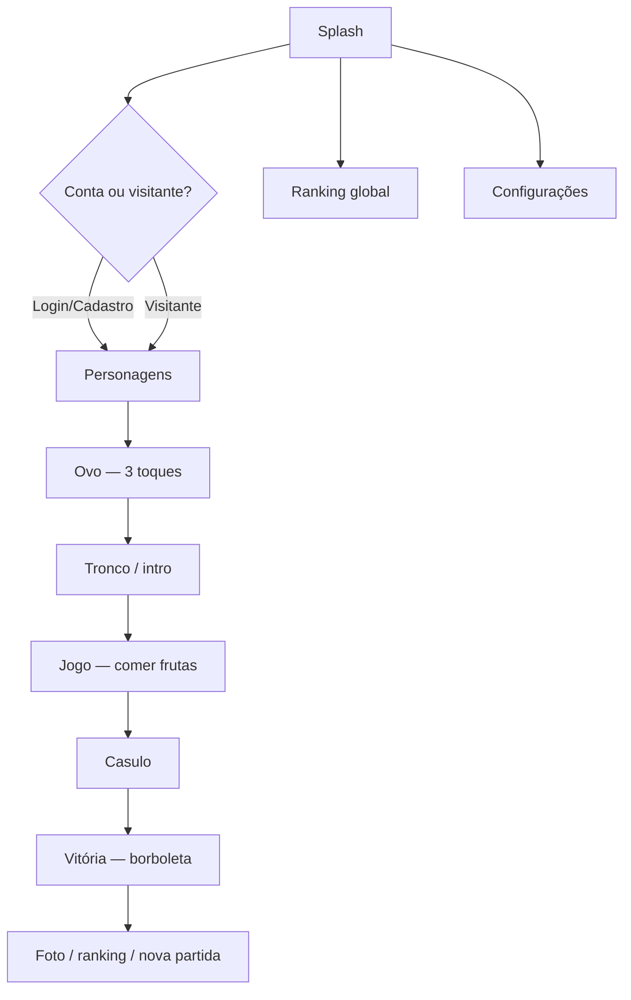

<p align="center">
  
</p>

<h1 align="center">Nhoc Nhoc! A Lagartinha da Turminha</h1>

<p align="center">
  Jogo educativo de <strong>metamorfose</strong> — da lagarta ao casulo e à borboleta<br />
  Web (GitHub Pages), Android (Capacitor) e API de conta/ranking
</p>

<p align="center">
  
  
  
  <br />
  
  
  
  <br />
  
  
  
</p>

---

## Links

<p align="center">
  <a href="https://dvizioon.github.io/VIZIOON-NHOCNHOC-FRONTEND/">
    
  </a>
  &nbsp;
  <a href="https://github.com/dvizioon/VIZIOON-NHOCNHOC-FRONTEND/releases">
    
  </a>
</p>

- [Repositório](https://github.com/dvizioon/VIZIOON-NHOCNHOC-FRONTEND)
- [GitHub Pages (web)](https://dvizioon.github.io/VIZIOON-NHOCNHOC-FRONTEND/)
- [Releases / APK `nhocnhoc.apk`](https://github.com/dvizioon/VIZIOON-NHOCNHOC-FRONTEND/releases)
- [API de produção](https://apinhocnhoc.clickupbot.com)

---

## Funcionalidades

- **Metamorfose completa:** Ovo → lagarta → tronco → jogo das frutas → casulo → borboleta.
- **Turminha:** Escolha personagens, voz de apresentação e jornada personalizada.
- **Conta ou visitante:** Login, cadastro, preferências locais e sync online quando conectado.
- **Ranking:** Menor tempo no topo; pódio dourado/prata/bronze; recap de frutas da partida.
- **Foto da borboleta:** Capture, baixe ou imprima no fim da jornada.
- **Áudio temático:** Música de fundo, SFX e vozes das crianças (desbloqueio após gesto do usuário).
- **Mobile first:** Layout responsivo, gestos e build Android via Capacitor.
- **Deploy automático:** GitHub Actions publica o jogo web a cada push na `main`.

## Tecnologias Utilizadas

- **Phaser 4:** Motor do jogo (cenas, sprites, áudio, render WebGL).
- **Vite 6:** Dev server, build e integração com Vitest.
- **Bun:** Instalação de dependências e scripts locais/CI.
- **Capacitor 8:** Empacotamento Android (`nhocnhoc.apk`).
- **Iconify:** Ícones locais (`solar`, `mynaui`, `mdi`, `healthicons`, …).
- **Vitest + jsdom:** Testes unitários em `test/`.
- **GitHub Pages:** Hospedagem do build web com `VITE_BASE_PATH` por repositório.

> [!IMPORTANT]
> Preferências de volume e modo de jogo são salvas no **localStorage**; com conta logada, sincronizam com a API quando online.

> [!NOTE]
> Use `.env` para apontar a API local (`VITE_GAME_API_URL`) ou abrir uma cena específica (`VITE_SCREEN_INIT`) durante o desenvolvimento.

> [!CAUTION]
> O APK de debug/release deve ser assinado para publicação na Play Store. O fluxo atual gera `nhocnhoc.apk` via Gradle.

## Plataformas

| Plataforma | Status |
|-----------|--------|
| Navegador (Chrome, Edge, Firefox) | Compatível |
| GitHub Pages | Compatível |
| Android (APK) | Compatível |
| iOS | Em breve (link configurável via `.env`) |

## Fluxo do jogo



## Estrutura do Projeto

```bash
game/
│
├── src/
│   ├── scenes/              # Splash, Egg, Game, Cocoon, Victory, …
│   ├── ui/                  # Modais, HUD, ranking, download APK
│   ├── systems/             # Áudio, música, voz, assets
│   ├── services/            # API, sessão, releases
│   ├── config/              # Tema, assets, regras, telas debug
│   ├── entities/            # Lagarta, renderers
│   └── utils/               # Estado, prefs, URLs, captura de foto
│
├── public/assets/           # Sprites, sons, UI, personagens
├── android/                 # Projeto Capacitor / Gradle
├── test/                    # Vitest (username, prefs, assets, …)
├── tools/                   # Scripts auxiliares (ícones Android)
├── .github/workflows/       # Deploy GitHub Pages
├── vite.config.js
├── capacitor.config.json
└── README.md
```

## Instalação

### Jogar online

Acesse [dvizioon.github.io/VIZIOON-NHOCNHOC-FRONTEND](https://dvizioon.github.io/VIZIOON-NHOCNHOC-FRONTEND/) no celular ou desktop.

### APK (Android)

1. Abra [GitHub Releases](https://github.com/dvizioon/VIZIOON-NHOCNHOC-FRONTEND/releases).
2. Baixe **`nhocnhoc.apk`**.
3. Instale no dispositivo (fontes desconhecidas, se necessário).

### Desenvolvimento local

1. **Clone o repositório:**

   ```bash
   git clone https://github.com/dvizioon/VIZIOON-NHOCNHOC-FRONTEND
   cd VIZIOON-NHOCNHOC-FRONTEND
   ```

2. **Configure o ambiente (opcional):** crie um `.env` na raiz do projeto (veja tabela abaixo).

3. **Instale e rode:**

   ```bash
   bun install
   bun run dev
   ```

   Abre em `http://localhost:5173` (ou `VITE_PORT`).

4. **Build web:**

   ```bash
   bun run build
   bun run preview
   ```

5. **Android (Capacitor):**

   ```bash
   bun run build
   bunx cap sync android
   cd android && ./gradlew assembleDebug
   # APK: android/app/build/outputs/apk/debug/nhocnhoc.apk
   ```

## Variáveis de ambiente (`.env`)

| Variável | Descrição |
|----------|-----------|
| `VITE_GAME_API_URL` | URL da API (ex.: `http://localhost:5240`) |
| `VITE_GAME_API` | `false` desliga chamadas à API |
| `VITE_BASE_PATH` | Base do deploy (GitHub Pages: `/REPO/`) |
| `VITE_SCREEN_INIT` | Abre cena específica no boot (debug) |
| `VITE_DEBUG` | Flags de debug/hitboxes |
| `VITE_APP_VERSION` | Versão exibida no app (CI preenche via tag Git) |

## Scripts

| Comando | Descrição |
|---------|-----------|
| `bun run dev` | Servidor de desenvolvimento (Vite) |
| `bun run build` | Build de produção → `dist/` |
| `bun run preview` | Preview do build local |
| `bun run test` | Testes em modo watch (Vitest) |
| `bun run test:run` | Testes uma vez (CI/local) |
| `bun run icons:android` | Gera ícones Android (Python) |

## Contato

Dúvidas e suporte: [danielmartinsjob@gmail.com](mailto:danielmartinsjob@gmail.com)

**Créditos:** Desenvolvido por Daniel Estevão + Fernanda Gama · **DVIZIOON**

## Licença

[](https://opensource.org/licenses/MIT)
